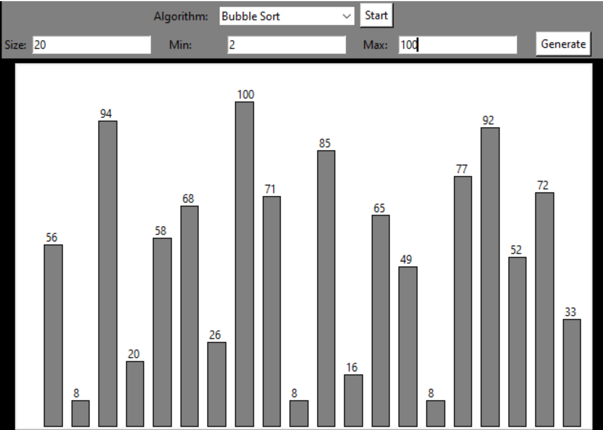
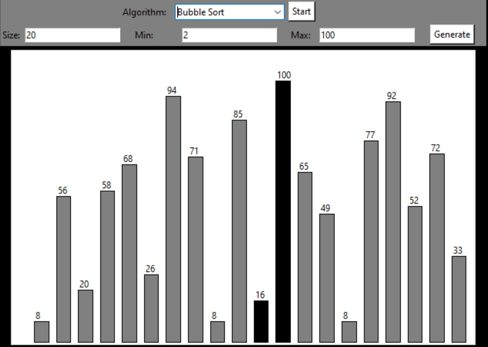
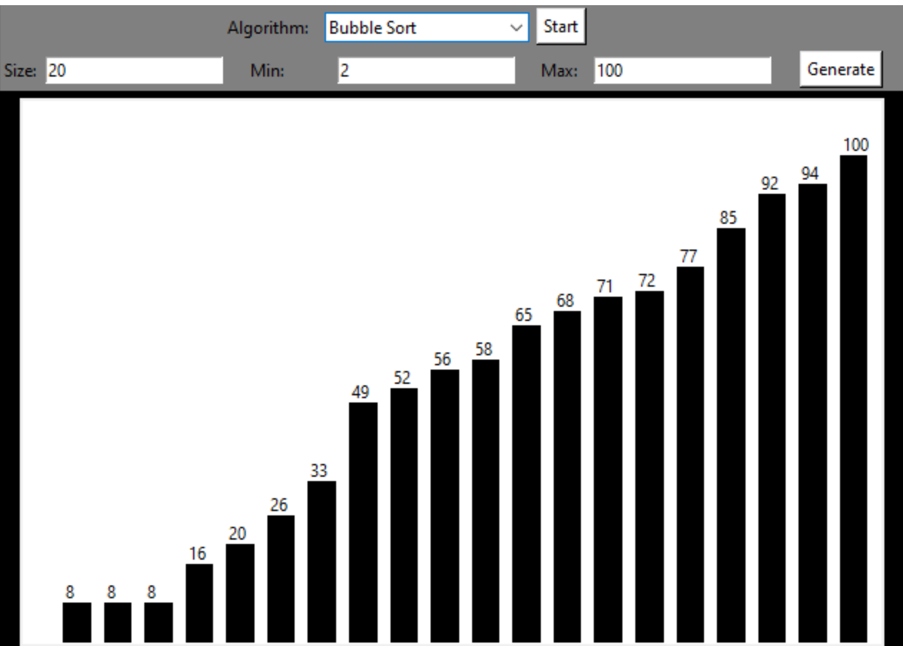

# Sorting Visualizer

Program that visualizes several well-known sorting algorithms using Python and Tkinter module.

## Visuals
  

          

## Contributing
Pull requests are welcome. For major changes, please open an issue first to discuss what you would like to change.

Please make sure to update tests as appropriate.
